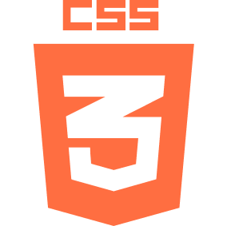

  

## Hola, soy Teo! 👋 

Trabajo como desarrollador frontend en _ADOX S.A. 🏢_ y me encuentro estudiando Ingeniería en Sistemas de Información en la _UTN Facultad Regional Buenos Aires_ 📚🇦🇷.

En mi formación secundaria me especialicé como Técnico Electrónico en la _EEST Nº8 de Haedo 🏫_. En el transcurso de estos años fui enfocando mi carrera al desarrollo de software, siendo este mi principal interés. Busco aprender continuamente y aplicar las nuevas tecnologías disponibles para los proyectos en los que participo.

Trabajé como diseñador en el _Open Innovation Center_ de ADOX, lo que incrementó mis habilidades referidas al ✏️ diseño, gracias a la transferencia de conocimiento de mis pares.

##### Tecnologías 💻

Estas son las tecnologías que estoy aprendiendo y aplicando:

  
  
  
  
  
  
  
  

##### Ponete en contacto conmigo 📞

  
  
  
  
  

  

&nbsp;
  

  

